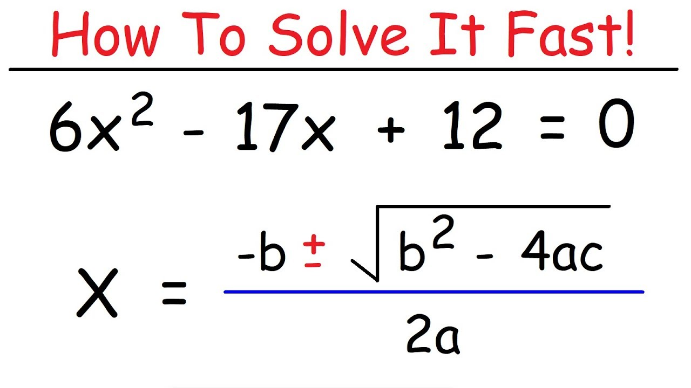

# This is a Title

Here I will explain the contents of the lecture and whether it is theory or problem solving or applications. This paragraph will be approximately this long: sample text sample text sample text sample text.

Figure Captions will go here, directly under the image. I'd prefer centre allignment but I think thats with CSS?

## Section 1

Here I will explain the first topic of the lecture in more detail.

**Here**|**is a**|**table**|
:---:|:---:|:---:
stuff|stuff|stuff

